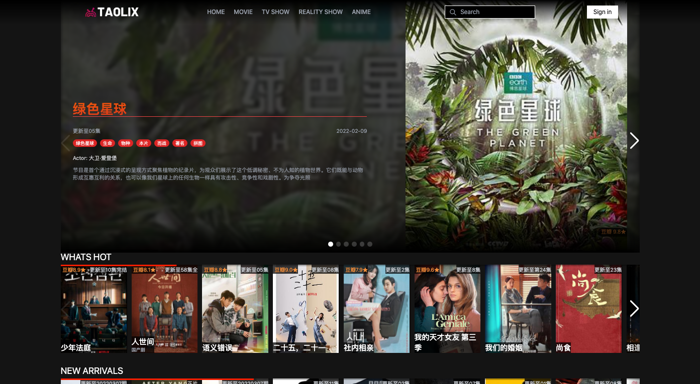
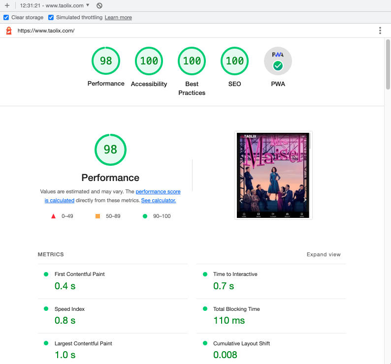

<div align="center">
<a href="http://www.taolix.com">
  
</a>
  <h1>Welcome to Taolix repository</h1>
  <strong>A open source video streaming service☕️</strong>
  <h6>Made with ❤️ &nbsp;by TATO</h6>
</div>
<br>

## 🍿[Taolix.com](https://www.taolix.com/)

> Taolix is an open source video streaming service that provide all free videos for all users free. 🆓

It collects videos, movies, shows and anime from 3rd party website and system for you to play.

<div align="center">
  
</div>

#### At Taolix we care about:

- 🧵 **Open-source**: Taolix is completely open-source. We believe in transparency and giving back to the community, so we decided to publish the source code to GitHub. Suggest a feature, report a bug, or even contribute. Everyone is welcome!

- 🌟 **Performance**: Taolix reaches as high as 98 scores of performance and all 100 of other categories testing by Lighthouse.
<div align="center">
  
</div>
<br>

## 📌 Using Taolix

Taolix is currently deployed on Vercel you can visit the website below:

<h2 align="center">
    <a href="http://www.taolix.com">
    Visit Taolix Website
    </a>
</h2>

## 📯 Philosophy

I build Taolix to help you:

- 👨‍💻 Stay up-to-date with new videos
- 🕒 Save time
- 📰 Discover videos in one click

## 🗂 Tech Stack

Below is a list of technologies we use at daily.dev.

- 🎨 **Frontend:** NEXTJS (SSG + ISG + SSR)
- 📠 **Pattern:** BFF
- 🌳 **Services+Backend:** Nextjs and node
- ☁️ **Cloud:** Vercel | SQL | Serverless
- ♾ **CI/CD:** Vercel
- 🎩 **Deployment:** Vercel

## 👓 Features

- PWA
- Lighting fast user experience
- Modern UI design
- Top movies and shows list
- Play video stream

## 🚀 Running daily.dev Locally

Dev:

```sh
npm run dev
```

Prod:

```sh
npm run build
```

## 🎨 Feature roadmap

- [x] Home page
- [x] Auth
- [x] Videos list
- [x] Player lib and component
- [x] Pagination
- [x] Video detail
- [x] Search
- [x] Genre
- [x] Fully Responsive
- [x] More video lists on homepage
- [x] Video autoplay
- [x] swiper
- [x] mobile navigation and bottom menu
- [x] SEO
- [x] Error pages
- [x] ISG
- [x] Refactor
- [x] Lazy loading DOMs for performance purposes
- [x] PWA
  - [x] Icons for all platform
  - [x] Cache stragety
  - [x] All needs for Lighthouse
- [x] IOS and Safari optimise
- [x] New player easier to use on all platform
- [x] Chromecast
- [x] Airplay
- [x] More source
- [x] Microservices and APIs redesign
- [x] Webpack Bundle Analyzer
- [x] BFF Microservices pattern
- [ ] Adaptive design
- [ ] History page
- [ ] Profile manager
- [ ] App

## 🤔 Questions

Taolix is listening your questions and issues you posted on Github. If we have violate any of your videos please contact us. We will do our best to make you satisfied.

## 📑 License

MIT
